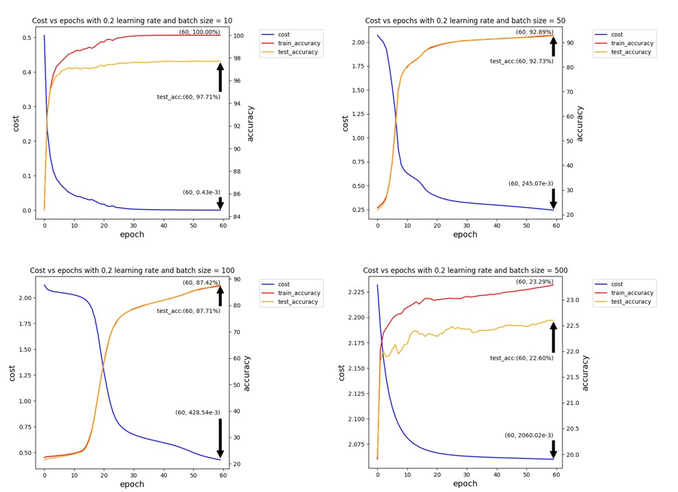

# Lab Assignment 1
## Requirements 
This assignment requires one to build a **feedforward neural network (FNN)** to classify the MNIST dataset. The network must have **two hidden layers with 100 and 150 neurons**, and deep-learning libraries such as Pytorch and Tensorflow are not allowed to use.

Next, in this assignment, one also requires to

1. Plot the learning curves and the accuracy of classification versus the number of iterations until convergence for training data as well as test data.

2. Repeat 1 with different batch sizes.

3. Repeat 1 by performing zero initialization for the model weights.

## Conclusion 
In this assignment, I build the FNN using **Numpy** libraries, which can be view [here](obj.py).

Next, from this assignment, the accuracy is **inversely proportional** to the batch size when the learning rate is fixed, means that the accuracy will become lower as we keep increasing the batch size. Below shows how accuracy changes with different batch size.

    
Also, for multi layers FNN, if initialize both weights and bias with zeros, the parameters will not be able to update during backpropagation. This is because the derivative of ReLU activation functions will equal to zero, resulting all the derivation will become zero.

    